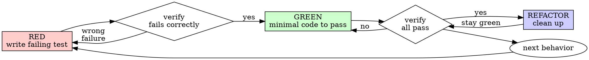

# Test-Driven Development

## Overview

Write the test first. Watch it fail. Write the minimal code that makes it pass.

**Core principle**: If you did not watch the test fail, you do not know whether it tests the right thing.

**Violating the letter of this rule is violating the spirit of this rule.**

## The Iron Law

```
NO PRODUCTION CODE WITHOUT A FAILING TEST FIRST
```

If you wrote code before a failing test existed: **delete it**. Start over.

No exceptions:
- Do not keep it "as reference"
- Do not "adapt" it while writing the test
- Do not even look at it while writing the test
- Delete means delete

Implement fresh, driven by the test.

## When It Applies

**Always** (default path):
- New features
- Bug fixes
- Refactoring that changes observable behavior
- Any behavior change

**Exceptions** (require explicit `--skip-tests` + logged bypass reason):
- Documentation-only changes
- Configuration that cannot meaningfully be unit-tested
- Throwaway prototypes (tell the user; offer a follow-up to TDD-ify if it lives)
- Generated code

If you are thinking "skip TDD just this once" and it is *not* one of the exceptions above: **stop**. That is rationalization. See `SKILL.md` Red Flags.

## Red-Green-Refactor



### 1. RED — Write ONE Failing Test

One behavior per test. Clear name. Real code (no mocks unless unavoidable — see `anti-patterns.md`).

<Good>
```typescript
test("retries failed operations 3 times then succeeds", async () => {
  let attempts = 0;
  const op = () => {
    attempts++;
    if (attempts < 3) throw new Error("fail");
    return "success";
  };
  const result = await retryOperation(op);
  expect(result).toBe("success");
  expect(attempts).toBe(3);
});
```
Tests real retry behavior using a counter, not a mock.
</Good>

<Bad>
```typescript
test("retry works", async () => {
  const mock = jest.fn().mockRejectedValueOnce(e).mockResolvedValueOnce("x");
  await retryOperation(mock);
  expect(mock).toHaveBeenCalledTimes(3);
});
```
Vague name. Tests the mock's behavior, not the retry logic.
</Bad>

### 2. VERIFY RED — Watch It Fail (MANDATORY)

```bash
{project test command} path/to/your.test.ts
```

Confirm:
- Test **fails** (not errors — errors mean typos, imports, syntax)
- The failure message matches what you expect
- Failure is because the feature is missing, not because the test is broken

**Test passes immediately?** You are testing existing behavior. Rewrite the test.

**Test errors?** Fix the error and re-run until it fails cleanly.

Per `skills/verify/`: quote the failing output in your message. "The test fails" is not evidence; the test output is.

### 3. GREEN — Minimal Code to Pass

Write the simplest thing that could possibly make the test pass.

<Good>
```typescript
async function retryOperation<T>(fn: () => Promise<T>): Promise<T> {
  for (let i = 0; i < 3; i++) {
    try { return await fn(); } catch (e) { if (i === 2) throw e; }
  }
  throw new Error("unreachable");
}
```
</Good>

<Bad>
```typescript
async function retryOperation<T>(fn, options?: { maxRetries?; backoff?; onRetry? }) {
  // Configurable retry with exponential backoff, jitter, circuit breaker, metrics
}
```
YAGNI. No test asked for any of that.
</Bad>

### 4. VERIFY GREEN — Watch It Pass (MANDATORY)

```bash
{project test command}
```

Confirm (all three):
- Your new test passes
- All previously-passing tests still pass
- Output is pristine (no errors, no warnings leaking from your code)

**Test still fails?** Fix the code, not the test.

**Other tests broke?** Fix them now, before moving on.

### 5. REFACTOR — Clean Up (Optional)

After green, and only after green:
- Remove duplication
- Improve names
- Extract helpers where obvious

Tests stay green throughout. Do not add behavior during refactor.

### 6. Repeat — Next Behavior

Back to RED for the next behavior. One behavior per cycle.

## Rationalization Prevention

| Excuse | Reality |
|--------|---------|
| "Too simple to test" | Simple code still breaks. Tests take 30 seconds. |
| "I'll test after" | Tests written after pass immediately, proving nothing. |
| "I already manually tested it" | Manual testing is ad-hoc. No record, not re-runnable. |
| "Deleting X hours of work is wasteful" | Sunk cost fallacy. Keeping unverified code is the real waste. |
| "Keep it as reference while I write the test" | You will adapt it. Delete means delete. |
| "Need to explore the API first" | Fine. Throw away the exploration, start TDD from scratch. |
| "This test is hard to write" | Listen to the test. Hard to test = hard to use. Simplify the interface. |
| "TDD will slow me down" | TDD is faster than debugging. Pragmatic = test-first. |
| "Tests after achieve the same goals" | Tests-after answer "what does this do?" Tests-first answer "what should this do?" |
| "The existing code has no tests either" | You are improving it. Add tests as you go. |
| "This is different because..." | It is not. |

## Red Flags — STOP and Restart with TDD

- Code written before any test exists
- Test passes immediately (you are testing existing behavior, not new behavior)
- You cannot explain *why* the test failed in the RED step
- "Just this once" rationalization
- Tests added "later"
- "Keep it as reference" or "adapt existing code"
- "I already spent X hours, deleting is wasteful"
- "TDD is dogmatic, I'm being pragmatic"
- "This task is different because..."

If any of these happen: **delete the production code and start over with a failing test**.

## Bug Fix Example

**Bug**: Form accepts empty email.

**RED**
```typescript
test("rejects empty email", async () => {
  const result = await submitForm({ email: "" });
  expect(result.error).toBe("Email required");
});
```

**VERIFY RED**
```
$ bun test
FAIL: expected 'Email required', got undefined
```

**GREEN**
```typescript
function submitForm(data: FormData) {
  if (!data.email?.trim()) return { error: "Email required" };
  // ... existing logic
}
```

**VERIFY GREEN**
```
$ bun test
PASS (all tests green)
```

**REFACTOR** (only if duplication exists): extract a `requireField()` helper if multiple fields need the same check.

## Verification Checklist (before declaring work done)

- [ ] Every new function/method has at least one test
- [ ] You watched each test fail before implementing
- [ ] Each test failed for the expected reason (feature missing, not a typo)
- [ ] You wrote the minimal code to pass each test
- [ ] All tests pass (full suite, not just yours)
- [ ] Output is pristine (no stray errors/warnings)
- [ ] Tests use real code (mocks only if unavoidable)
- [ ] Edge cases and error paths from the design doc are covered

Cannot check all boxes? You skipped TDD. Start over.

## When Stuck

| Problem | Solution |
|---------|----------|
| Do not know how to test | Write the wished-for API. Write the assertion first. Ask the user. |
| Test is too complicated | Design is too complicated. Simplify the interface. |
| Have to mock everything | Code is too coupled. Use dependency injection. |
| Setup is huge | Extract helpers. Still complex? Design smell — simplify. |

## Integration with super-aidlc

- **Design phase**: the design doc's "Required Test Scenarios" section tells you what tests to write first.
- **Construction phase**: `agents/builder.md` Self-Check enforces TDD per unit. Violations become `BLOCKED` status.
- **`--skip-tests` flag**: explicit Iron Law bypass. Must log the reason in `build-log.md` under "Iron Law Bypasses" — see `phases/construction.md` Step 8 template.
- **Verify skill**: every "tests pass" / "green" claim must quote the test command output per `skills/verify/`.
- **Debugger integration**: when `skills/debug/` fixes a bug, the fix MUST include a regression test that was first seen failing (red) before the fix, then passing (green) after.

## Anti-Patterns Reference

When adding mocks or test utilities, read `anti-patterns.md` in this same directory to avoid:
- Testing mock behavior instead of real behavior
- Adding test-only methods to production classes
- Mocking without understanding dependencies
- Tests that double as implementation documentation

## The Bottom Line

```
Production code exists → test exists and was seen failing first
Otherwise → not TDD
```

No exceptions without the user's explicit `--skip-tests` flag AND a logged reason.
